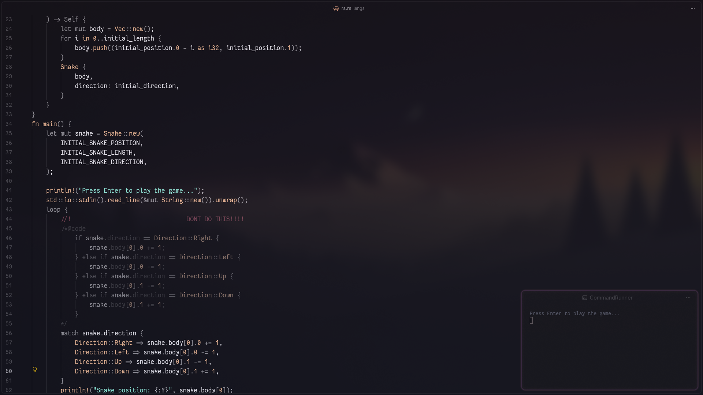

# CodeInComments

CodeInComments is a Visual Studio Code extension that highlights code markers
inside comments while preserving the syntax highlighting of the current file
language. The marked code receives configurable opacity and grayscale effects.



## Supported markers

The extension supports implicit `@code` markers. The language is inferred from
the host file:

```javascript
/*@code
const message = "Hello, world!";
console.log(message);
*/

//@code const enabled = true;
```

The language is inferred from the host file, so markers stay concise and do not
need a language name.

The `$` abbreviation can be enabled with `codeInComments.enableAbbreviations`:

```json
{
	"codeInComments.enableAbbreviations": true
}
```

When enabled, `/*$ ... */`, `//$ ...`, and `#$ ...` are accepted as aliases for
the corresponding implicit `@code` forms.

Syntax highlighting for implicit markers is currently implemented for
JavaScript, Rust, and Python. Support for additional host languages is pending.

## Configuration

### `codeInComments.opacity`

Controls the opacity applied to marked code. The value is between `0` and `1`.
The default is `0.5`.

```json
{
	"codeInComments.opacity": 0.7
}
```

### `codeInComments.grayscale`

Controls the grayscale percentage applied to marked code. The value is between
`0` and `100`. The default is `25`.

```json
{
	"codeInComments.grayscale": 40
}
```

## Development

### Requirements

- VS Code `1.39.0` or newer.
- Node.js and npm.

### Install and run

```bash
npm install
```

Open the project in VS Code and press `F5` to start an Extension Development
Host. Open a JavaScript, Rust, or Python file containing a supported marker.

### Validate

```bash
python3 -m json.tool package.json > /dev/null
for file in syntaxes/*.json; do python3 -m json.tool "$file" > /dev/null; done
node --check extension.js
npm test
npm run build
```

## Project structure

```text
.
├── extension.js
├── public/
│   └── example.webp
├── syntaxes/
│   ├── comment.message.javascript.json
│   ├── comment.message.python.json
│   └── comment.message.rust.json
├── test/
│   ├── langs/
│   │   ├── js.js
│   │   ├── py.py
│   │   └── rs.rs
│   └── test.js
├── package.json
└── README.md
```

## Status

The first functional version is implemented. Future versions may add support
for more host languages and automated extension tests.
